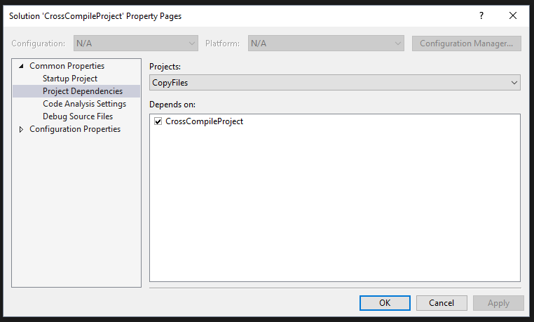
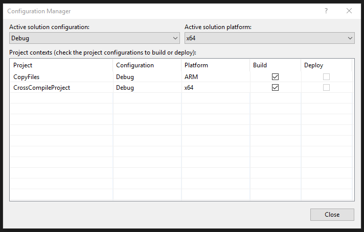
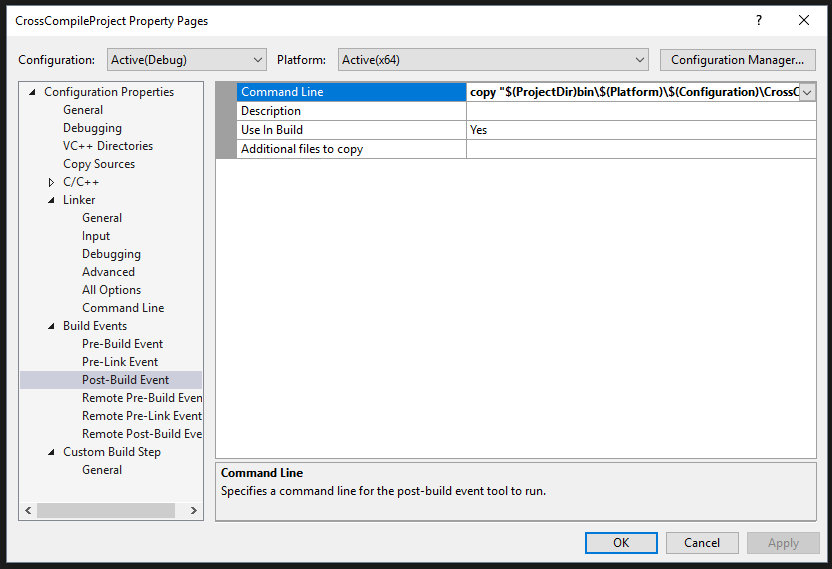
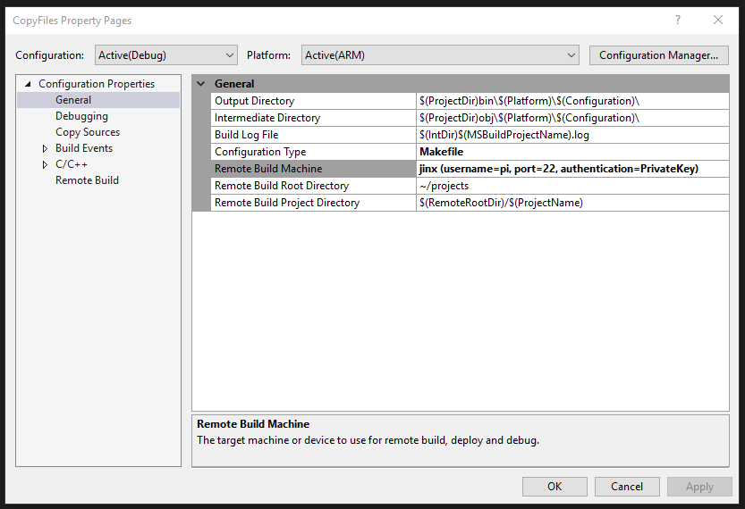
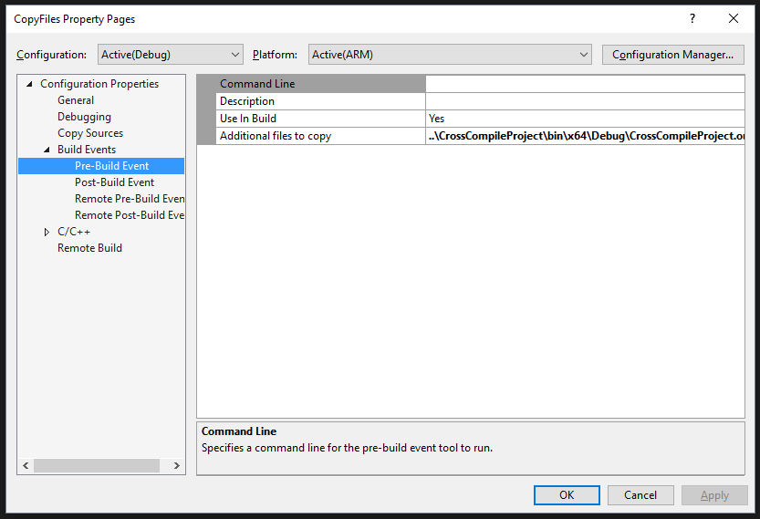
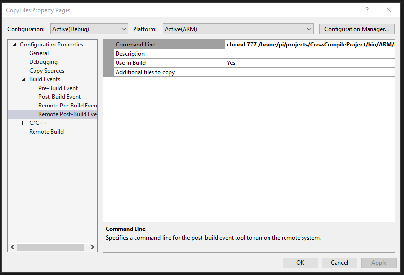

# Cross compile on Linux with Visual Studio
This example requires Visual Studio 2017 with the Linux Workload selected or Visual Studio 2015 with the Visual C++ for Linux extension installed. You can find out more about these components on the [C++ team blog](http://aka.ms/vslinux).

You need a Linux system with ARM cross compilers installed for this project. On Windows 10 you can use the Windows Subsystem for Linux instead of a remote Linux machine or VM, that is how I prepared this project. To setup your Linux enviornment for cross compiling targetting a Raspberry Pi follow [this guide](http://hackaday.com/2016/02/03/code-craft-cross-compiling-for-the-raspberry-pi/) by @rud-had.

This solution is organized such that there is a project used for building and debugging source (CrossCompileProject), and another (CopyFiles) to copy outputs to a remote ARM target. The trick here is that we use the x64 configuration for build and ARM for debug. In the solution properties under Project Dependencies we have set the project CopyFiles to depend on CrossCompileProject.



Next in Configuration Manager we have set for Debug x64 that CopyFiles is to build for ARM and CrossCompileProject builds for x64.



For the CrossCompileProject project properties under General the Remote Build Machine is set to our x64 Linux enviornment with cross compilers installed. Here I am using localhost to connect to my local WSL enviornment.


Looking under C/C++ All Options you can see the switches that correspond to the above guide in bold. Note especially the C++ Compiler override to use the cross compiler. Also, contrary to the guide we've set optimization to disabled so we get debugging symbols.


Note under Linker you also need to override the default linker value so the cross compiler is used.


Now, under Build Events, Post-Build Event we are going to copy the x64 build output to the ARM build output directory for use in debugging. An example command line for this is:

```copy "$(ProjectDir)bin\$(Platform)\$(Configuration)\CrossCompileProject.out" "$(ProjectDir)bin\ARM\$(Configuration)\CrossCompileProject.out"```



We can't copy this output to an ARM Linux machine as part of this build as the project is configured to connect to an x64 Linux machine. That is why we have the CopyFiles makefile project configured to build for ARM after the CrossCompileProject builds for x64. CopyFiles has the project properties set so the Remote Build Machine is our ARM debug target. 



Under Build Events, Pre-Build Event we have set Additional Files to copy to take the cross compile output from the x64 project and copy it to our remote ARM Linux target:

```..\CrossCompileProject\bin\ARM\Debug\CrossCompileProject.out:=/home/pi/projects/CrossCompileProject/bin/ARM/Debug/CrossCompileProject.out```



We have also specified a Remote Post-Build Event to execute a command on the remote Linux target to ensure our output is executable.

```chmod 777 /home/pi/projects/CrossCompileProject/bin/ARM/Debug/CrossCompileProject.out```



With the above configuration we can now build the solution which will produce ARM binaries on our x64 target using cross compilers, then it will copy them to our ARM target.

To debug change your configuration to ARM. Now on back on the CrossCompileProject project properties under General the Remote Build Machine should be set to the same ARM target used above.


Set a breakpoint and hit F5 and you should be able to debug on your ARM target board. 

Note that the above configuration is tailored to use output locations expected by the VS Linux build system. You can use other output values, but you may need to make some further configuration changes to get it to work. Of note on the project properties for the ARM debug target you may need to modify the value for program to match your output rather than the expected default value.

